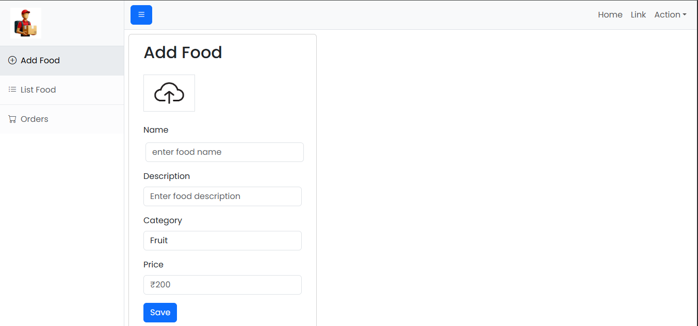
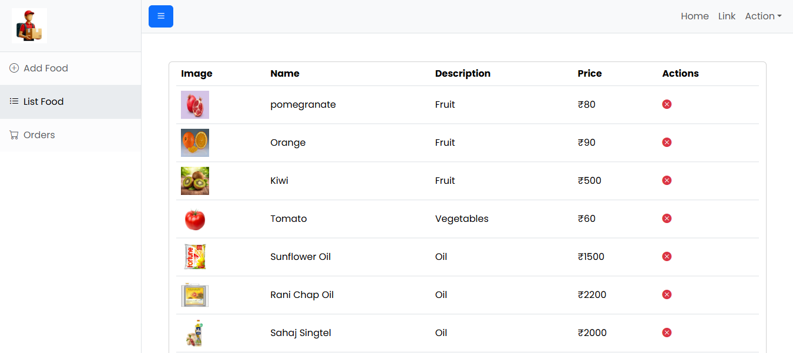

# 🛒 Grocery Store Admin Panel

A modern and responsive Admin Dashboard built using **React.js**, **Spring Boot**, **MongoDB**, and **Cloudinary** for managing grocery products, inventory, and customer orders efficiently.

---

## 🚀 Features

### 🥦 Product Management

✅ Add new grocery products

✅ Upload product images

✅ Manage product details (Name, Category, Price, Description)

✅ View all available products

✅ Delete products from inventory

### 📦 Inventory Management

✅ Organize products by categories

✅ Manage stock items

✅ Maintain product catalog

### 🛍️ Order Management

✅ View customer orders

✅ Track order status

✅ Manage order fulfillment

### 🎨 Admin Dashboard

✅ Responsive UI

✅ Sidebar Navigation

✅ Product Listing Table

✅ Image Upload Support

---

## 🛠️ Tech Stack

| Technology  | Purpose             |
| ----------- | ------------------- |
| React.js    | Frontend UI         |
| Bootstrap   | Styling             |
| Axios       | API Communication   |
| Spring Boot | Backend Development |
| MongoDB     | Database            |
| Cloudinary  | Image Storage       |
| REST API    | Data Exchange       |

---

## 📸 Screenshots

### ➕ Add Product Page



**Features**

* Upload Product Image
* Add Product Information
* Set Product Category
* Enter Product Price
* Save Product

---

### 📋 Product Management Page



**Features**

* View Available Products
* Manage Inventory
* Delete Products
* Product Categorization

---

## 📂 Project Structure

```bash
adminpanel/
│
├── screenshots/
│   ├── add-product.png
│   └── product-list.png
│
├── src/
│   ├── components/
│   ├── pages/
│   ├── assets/
│   ├── services/
│   └── App.jsx
│
├── public/
└── package.json
```

---

## ⚙️ Installation

### Clone Repository

```bash
git clone https://github.com/prince2655/Grocery-Store.git
```

### Navigate to Project

```bash
cd Grocery-Store/adminpanel
```

### Install Dependencies

```bash
npm install
```

### Run Application

```bash
npm run dev
```

Application will start on:

```bash
http://localhost:5173
```

---

## 🔗 Backend Configuration

Configure backend API URL:

```javascript
const API_URL = "http://localhost:8080";
```

---

## 🌟 Key Highlights

✔ Grocery Product Management

✔ Inventory Administration

✔ Image Upload Support

✔ MongoDB Integration

✔ REST API Architecture

✔ Responsive Dashboard

✔ Scalable Application Structure

---

## 🎯 Future Enhancements

* 🔐 Admin Authentication
* 📊 Sales Analytics Dashboard
* 🔍 Product Search & Filters
* 📦 Stock Monitoring
* 📈 Inventory Reports
* 👥 Role-Based Access Control
* 📱 Enhanced Mobile Support


### ⭐ If you found this project useful, don't forget to Star the repository!
